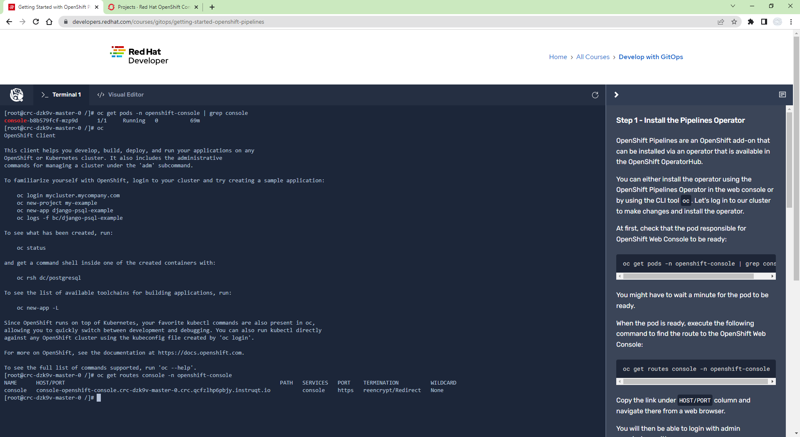
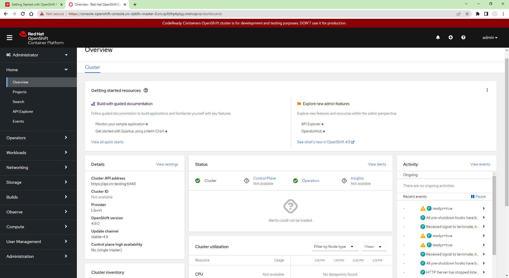
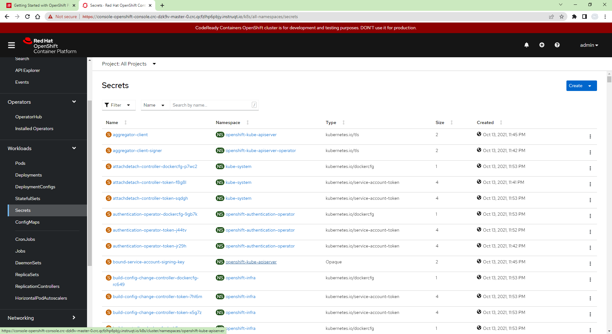
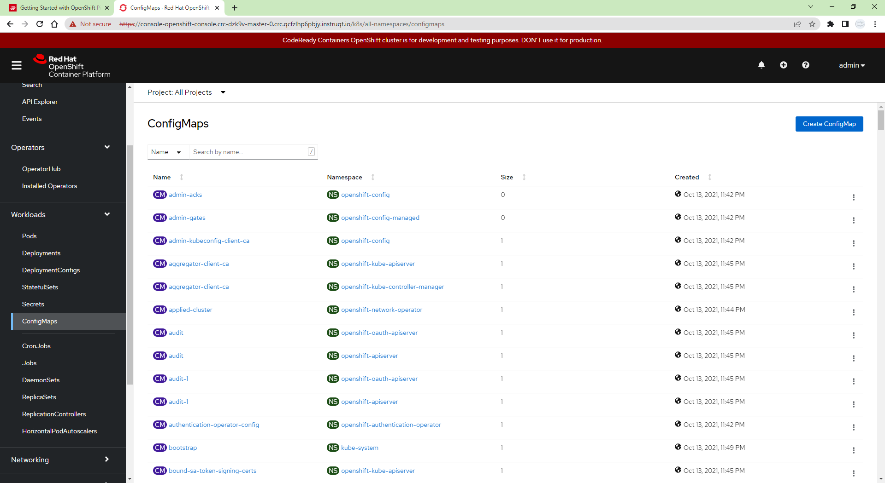
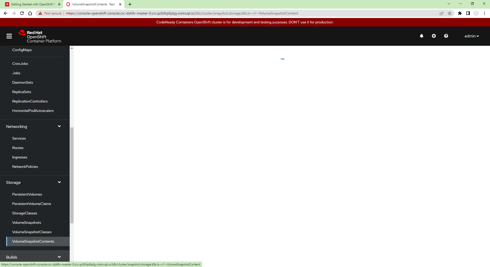
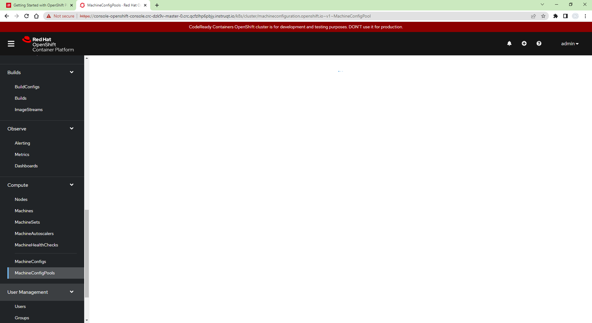

# MyOpenShift

My OpenShift


## Pipeline


```dos
oc
oc get pods -n openshift-console | grep console
oc get routes console -n openshift-console
oc apply -f /opt/operator/subscription.yaml
```


subscription.yaml

```yml
apiVersion: operators.coreos.com/v1alpha1
kind: Subscription
metadata:
  name: openshift-pipelines-operator
  namespace: openshift-operators
spec:
  channel: stable
  name: openshift-pipelines-operator-rh
  source: redhat-operators
  sourceNamespace: openshift-marketplace
```

```dos
until oc api-resources --api-group=tekton.dev | grep tekton.dev &> /dev/null
do
 echo "Operator installation in progress..."
 sleep 5
done

echo "Operator ready"
```







DeploymentConfigs

StatefulSets










